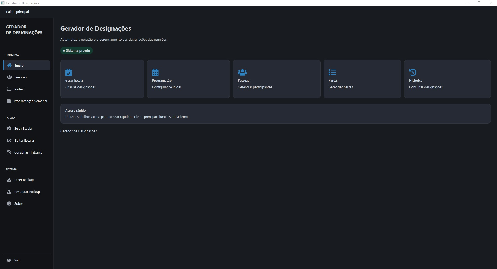

# Gerador de Designações

Aplicação desktop para configuração de programações semanais, geração e edição de escalas de designações. O sistema foi desenvolvido em JavaFX, utiliza SQLite para persistência local e aplica regras de elegibilidade, distribuição e histórico para apoiar a organização das reuniões.

## Visão geral

O projeto reúne em uma única aplicação:

- cadastro e edição de pessoas;
- cadastro e edição de partes da reunião;
- configuração da programação semanal;
- seleção de partes variáveis e inclusão automática de partes fixas;
- geração, revisão, edição e salvamento de escalas;
- consulta do histórico de designações;
- backup manual, restauração e backup automático do banco;
- exportação de designações elegíveis para o formulário PDF S-89.

As funcionalidades são organizadas em camadas de modelo, acesso a dados, serviços, controladores e views JavaFX. A aplicação é destinada a uso local e não possui backend ou serviço remoto.

## Captura de telas





## Funcionalidades implementadas

### Cadastros

- Cadastro, edição e gerenciamento de pessoas.
- Cadastro e edição de partes da reunião.
- Configuração das participações necessárias, privilégio mínimo, sexo permitido, nível de leitura e necessidade de ajudante de cada parte.

### Programação semanal

- Criação e consulta de programações por data.
- Inclusão automática das partes fixas.
- Seleção e remoção de partes variáveis, respeitando o limite de 3 a 6 partes variáveis.
- Definição de tema para as partes que possuem tema.
- Edição do número oficial de cada `ProgramacaoParte`, individualmente por semana.
- Números oficiais positivos ou vazios; a ordem interna da programação permanece separada desse número.


### Geração e edição de escalas

- Geração de escalas por data ou mês.
- Revisão da escala antes do salvamento.
- Edição de designações salvas, incluindo responsável e ajudante quando aplicável.
- Salvamento das escalas e das designações no SQLite.
- Distribuição baseada em atividade, privilégios, sexo permitido, participações exigidas, nível de leitura, histórico e regras específicas de cada parte.

### Histórico

- Registro e consulta do histórico de participações.
- Uso do histórico para reduzir repetições e apoiar a distribuição das designações.

### Backup e restauração

- Backup manual do banco pela interface.
- Restauração de um arquivo `.db` pela interface.
- Backup automático no início da aplicação e a cada 24 horas enquanto ela estiver aberta.
- Backups automáticos recebem data e hora no nome para evitar a substituição de arquivos anteriores.

## Exportação para PDF S-89

Na tela de **Programação Semanal**, selecione a semana e clique em **Exportar S-89**. A exportação consulta somente a escala já salva e a programação correspondente no banco; ela não gera nem substitui escalas automaticamente.

Atualmente são exportadas as designações das partes elegíveis:

- parte com tipo `LEITURA`;
- partes do tipo `DEMONSTRACAO` pertencentes à seção `MINISTERIO`, que representa as partes de ministério cadastradas na aplicação.

Antes de criar o arquivo, o serviço valida a existência da escala salva, da programação semanal, do participante e do número oficial da `ProgramacaoParte`. Se algum dado obrigatório estiver ausente, a operação informa o erro e não cria um PDF incompleto.

O formulário utiliza o modelo versionado em `modelos/S-89_T.pdf` e preenche:

| Campo do formulário | Conteúdo |
| --- | --- |
| `900_1_Text_SanSerif` | Nome do responsável ou participante da parte |
| `900_2_Text_SanSerif` | Nome do ajudante, quando houver |
| `900_3_Text_SanSerif` | Intervalo semanal de segunda-feira a domingo, em português |
| `900_4_Text_SanSerif` | Número oficial e nome da parte, por exemplo `3 — Leitura` |
| `900_5_CheckBox` | Salão principal, marcado |
| `900_6_CheckBox` | Sala B, desmarcado |
| `900_7_CheckBox` | Sala C, desmarcado |

Exemplos de intervalo no campo de data:

```text
05 - 11 de Outubro
28 de Setembro - 04 de Outubro
28 de Dezembro de 2026 - 03 de Janeiro de 2027
```

Por padrão, os arquivos são salvos em:

```text
%USERPROFILE%\GeradorDesignacoes\S-89\
└── Outubro 2026\
    └── Semana 1 - 07-10-2026\
        └── S89_Leitura_Biblia.pdf
```

O exportador não sobrescreve arquivos existentes. O caminho do modelo e o diretório de saída podem ser configurados por propriedades do sistema:

```text
-Ds89.template=C:\caminho\S-89_T.pdf
-Ds89.output.dir=C:\caminho\de\saida
```

O local da reunião não é obtido do banco; por isso, apenas o checkbox **Salão principal** é marcado automaticamente.

## Tecnologias utilizadas

As versões abaixo são as declaradas no `pom.xml`:

- Java 22;
- Maven;
- JavaFX Controls e FXML 21.0.7;
- SQLite JDBC 3.50.3.0;
- Apache PDFBox 3.0.5;
- Ikonli JavaFX 12.3.1;
- Ikonli FontAwesome 5 Pack 12.3.1;
- JUnit Jupiter 5.10.2;
- JUnit 4.13.1;
- Maven Compiler Plugin 3.13.0;
- Maven Surefire Plugin 3.2.5;
- JavaFX Maven Plugin 0.0.8.

## Arquitetura e organização do código

O projeto utiliza uma organização em camadas:

- `model`: entidades, records e enums do domínio, como `Pessoa`, `Parte`, `Designacao`, `Escala`, `ProgramacaoSemana` e `ProgramacaoParte`;
- `dao`: consultas e operações de persistência no SQLite;
- `service`: regras de negócio, geração, programação semanal, backup e exportação S-89;
- `controller`: coordenação entre views e services;
- `view`: telas e componentes JavaFX;
- `database`: conexão, inicialização, migrações, backup e restauração;
- `teste`: utilitário para inspeção do modelo PDF S-89.

O fluxo principal é iniciado por `MainApp`. Na inicialização, o banco é preparado por `DatabaseInitializer`, o backup automático é iniciado e a interface principal é exibida.

## Requisitos

- JDK 22;
- Maven disponível no `PATH`;
- sistema operacional Windows para o caminho atual de armazenamento baseado em `LOCALAPPDATA`;
- acesso à internet na primeira compilação, para que o Maven possa baixar as dependências;
- arquivo `modelos/S-89_T.pdf` presente para utilizar a exportação S-89.

## Instalação e execução

Na raiz do projeto:

```bash
git clone https://github.com/Joaombcoelho/gerador-designacoes.git
cd gerador-designacoes
mvn javafx:run
```

O plugin JavaFX está configurado para iniciar `br.com.geradordesignacoes.MainApp`.

## Testes

Para compilar e executar todos os testes:

```bash
mvn test
```

Os testes ficam em `src/test/java` e cobrem modelos, regras de negócio, services, DAOs, programação semanal, geração de escalas e exportação do S-89.

## Banco de dados e persistência

O banco é SQLite e é criado automaticamente na primeira inicialização. No Windows, o caminho usado pelo `ConnectionFactory` é:

```text
%LOCALAPPDATA%\GeradorDesignacoes\gerador-designacoes.db
```

O inicializador cria ou atualiza a estrutura e cadastra dados iniciais quando necessário. Entre as tabelas utilizadas estão:

- `pessoa`;
- `parte`;
- `parte_participacao_necessaria`;
- `historico_designacoes`;
- `escala`;
- `designacao`;
- `programacao_semana`;
- `programacao_parte`.

`programacao_parte.numero_oficial` pertence à parte dentro de uma programação semanal. Ele não altera o cadastro mestre em `parte` e não substitui a coluna `ordem`.

Os backups automáticos são gravados em:

```text
%LOCALAPPDATA%\GeradorDesignacoes\backups\
```

O backup manual permite escolher o arquivo de destino. A restauração substitui o banco local pelo arquivo selecionado e a interface orienta reiniciar a aplicação para carregar os dados restaurados.

## Estrutura de pastas relevante

```text
gerador-designacoes/
├── modelos/
│   ├── S-89_T.pdf
│   └── S-89_visualizacao.png
├── screenshot/
│   ├── Home.jpg
│   ├── Tela Cadastro parte.jpg
│   ├── Tela Historico.jpg
│   └── Tela Programacao.jpg
├── src/
│   ├── main/java/br/com/geradordesignacoes/
│   │   ├── controller/
│   │   ├── dao/
│   │   ├── database/
│   │   ├── model/
│   │   ├── service/
│   │   └── view/
│   └── test/java/br/com/geradordesignacoes/
├── pom.xml
└── README.md
```

## Estado atual e melhorias futuras

O projeto possui uma aplicação desktop funcional para cadastro, programação semanal, geração, edição, persistência e consulta de escalas, com backup local e exportação S-89 para as partes atualmente elegíveis.

O estado atual ainda é direcionado a uso local em Windows.

Possíveis evoluções, sem compromisso de implementação neste momento:

- ampliar os formatos e modelos de exportação;
- aprimorar relatórios e filtros de histórico;
- melhorar a validação e a visualização de conflitos;
- evoluir a distribuição das designações conforme novas regras confirmadas.
- permitir configuração de múltiplos locais de reunião e exportação S-89 com base no local selecionado;
- Leitura do PDF da apostila, para a configuração automatica das partes e obtenção dos temas.
- Geração do formulário S-140, com toda a programação da reunião e todos os participantes.